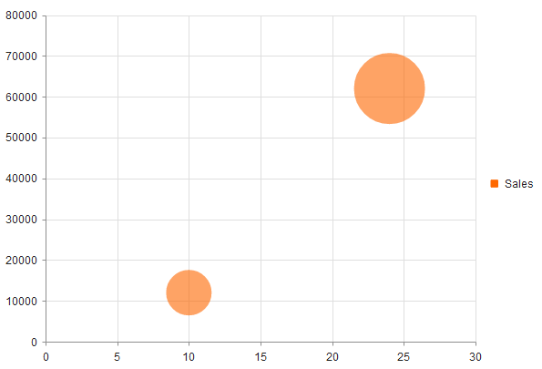

## Bubble Chart

A Bubble Chart represents data points as circles positioned on an X and Y axis.

Each data point has three values - X, Y and Size.
The circle area corresponds to the Size value.

### When to use a Bubble Chart
The Bubble charts are well suited for displaying dozens to hundreds of values.
They are especially useful for visualizing Size values that differ by several orders of magnitude.

As the Size value is represented as circle area, it is best to plot positive values.

#### Negative values
Negative values are not displayed by default. If you choose to display them,
their area will be calculated as if their value was positive. The point label will
display their actual value. They will also have a different color.

This behavior is controlled using the `negativeValues.visible` and
`negativeValues.color` options applicable to each series.

### Creating a Bubble Chart

For example, let's visualize the following data points:

    var salesData = [{
        numberOfSales: 10,
        volume: 12000,
        marketShare: 0.1
    }, {
        numberOfSales: 24,
        volume: 62000,
        marketShare: 0.25
    }];

    $("#chart").kendoChart({
        dataSource: {
            data: salesData
        },
        series: [{
            name: "Sales",
            type: "bubble",
            xField: "numberOfSales",
            yField: "volume",
            sizeField: "marketShare"
        }]
    });

This Produces the following chart:

 
