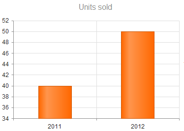

# Date Series

## Contents

* [Categorical date series](#categorical-date-series)

    * [Category binding](#category-binding)
    * [Date grouping](#date-grouping)
    * [Base units](#base-units)

* [Scatter date series](#binding-to-a-data-source)
    * [Base units](#base-units)

## Categorical date series

Categorical series have built-in support for displaying dates. This includes:

* Automatic selection of granularity/base unit (minutes, hours, days, etc.)
* Label formatting matched to the granularity
* Grouping of categories into base units and series aggregates

Specifying categories of type Date will switch the axis to date mode.
The automatic mode selection can be overriden by setting
[categoryAxis.type](/api/dataviz/chart#categoryAxis.type) to "Date".

### Category binding

Date series should be bound using
[categoryField](/api/dataviz/chart#configuration-series.categoryField).

The categories (dates) for all series will be sorted and merged during data binding.

### Date grouping

If series contain more than one value for a given period (base unit),
then they'll be aggregated to display a single value.

#### Example: Date series

    

    

Produces the following chart. Note that values are displayed as-is:

Now change the base unit to "years":

#### Example: Date series with grouping by year

    $("#chart").kendoChart({
        dataSource: {
            data: seriesData
        },
        series: [{
            type: "column",
            field: "value",
            categoryField: "date"
        }],
        categoryAxis: {
            baseUnit: "years"
        }
    });

Notice how the chart now displayes the maximum value for each year:

The aggregate function can be changed for each series:

#### Example: Date series with "sum" aggregate

    $("#chart").kendoChart({
        dataSource: {
            data: seriesData
        },
        series: [{
            type: "column",
            field: "value",
            categoryField: "date",
            aggregate: "sum"
        }],
        categoryAxis: {
            baseUnit: "years"
        }
    });

Available options are:

* min
* max (default)
* count
* sum
* avg
* first
* function (values, series) (Custom aggregate)

### Base units

The default base unit is determined from the smallest duration between categories.
For example:

    categoryAxis: {
        categories: [new Date(2005, 0, 1), new Date(2006, 0, 1)]
        // baseUnit is set to "years"
    }

    categoryAxis: {
        categories: [new Date(2005, 1, 1), new Date(2005, 1, 2)]
        // baseUnit is set to "days"
    }

The [baseUnit](/api/dataviz/chart#configuration-categoryAxis.baseUnit) can be specified manually.
Valid options are:

* seconds
* minutes
* hours
* days
* weeks
* months
* years
* fit (see below)

You can also choose to show every n-th base unit by setting the
[baseUnitStep](/api/dataviz/chart#configuration-categoryAxis.baseUnitStep)
option.

#### Automatic fitting

Setting [baseUnit](/api/dataviz/chart#configuration-categoryAxis.baseUnit)
to "fit" will constraint the total number of base units to
[maxDateGroups](/api/dataviz/chart#configuration-categoryAxis.baseUnit).

The baseUnit and baseUnitStep will be chosen according to
[autoBaseUnitSteps](/api/dataviz/chart#configuration-categoryAxis.autoBaseUnitSteps)

##### Example: Fit date series

    

    

##### Labels format

The date category axis supports specifying one format per base unit.

    categoryAxis: {
        labels: {
            dateFormats: {
                days: "M/d"
            }
        }
    }

The [`labels.format` property](/api/dataviz/chart#categoryaxis.labels.format-string) takes priority, if specified.

The global KendoUI culture is used for formatting the dates.
It can be overriden by setting `labels.culture`.

## Scatter date series

Scatter series have built-in support for displaying dates.
This includes:

* Automatic selection of granularity/base unit (minutes, hours, days, etc.)
* Label formatting matched to the granularity

The X/Y axis will switch to date mode if the series values are of type Date.
The automatic mode selection can be overriden by specifying `type: "Date"`

The following options accept dates:

* [min](/api/dataviz/chart#configuration-xAxis.min)
* [max](/api/dataviz/chart#configuration-xAxis.max)
* [axisCrossingValue](/api/dataviz/chart#configuration-xAxis.axisCrossingValue)

The following options are expressed in base units:

* [minorUnit](/api/dataviz/chart#configuration-xAxis.minorUnit)
* [majorUnit](/api/dataviz/chart#configuration-xAxis.majorUnit)

### Base Units

The default base unit is determined from the axis (or series) range.
For example:

    xAxis: {
        min: new Date(2005, 0, 1),
        max: new Date(2006, 0, 1)
        // baseUnit is set to "years"
    }

    xAxis: {
        min: new Date(2005, 1, 1),
        max: new Date(2005, 1, 2)
        // baseUnit is set to "days"
    }

The base unit can also be specified manually. Valid options are:

* seconds
* minutes
* hours
* days
* weeks
* months
* years

#### Labels format

The date axis supports specifying one format per base unit.

    xAxis: {
        labels: {
            dateFormats: {
                days: "M/d"
            }
        }
    }

The [`labels.format` property](/api/dataviz/chart#xAxis.labels.format) property takes priority, if specified.

The global KendoUI culture is used for formatting the dates.
It can be overriden by setting [`labels.culture` property](/api/dataviz/chart#xAxis.labels.culture).

