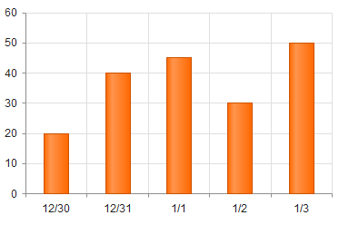
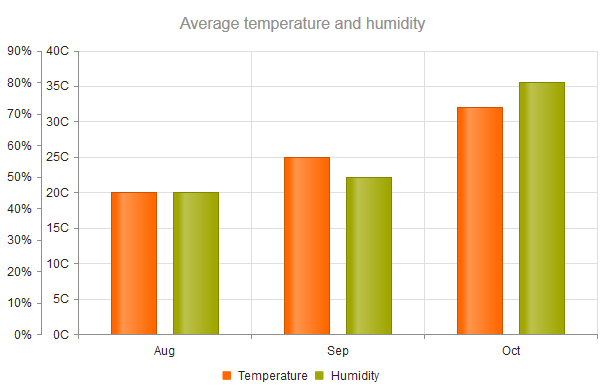
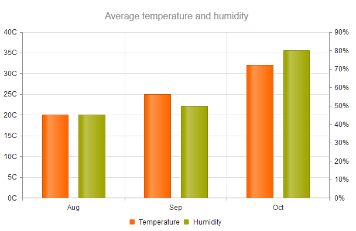
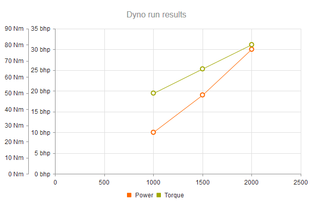
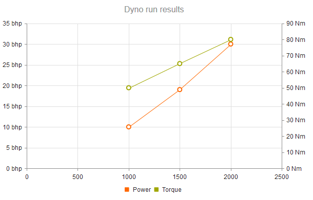
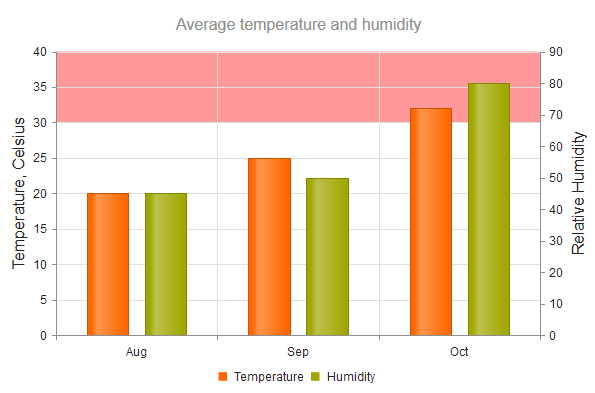

# Chart Overview

## Contents

* [Getting started](#getting-started)

* [Categorical charts](#categorical-charts)
    * [Category axis](#category-axis)
        * [Displaying Dates](#category-date-axis)
    * [Value axis](#value-axis)
    * [Multiple value axes](#multiple-value-axes)
    * [Axis crossing value(s)](#axis-crossing-values)

* [Scatter charts](#scatter-charts)
    * [Displaying Dates](#xy-date-axis)
    * [Multiple X/Y axes](#multiple-xy-axes)
    * [Axis crossing value(s)](#axis-crossing-values)

* [Common features](#common-features)
    * [Axis title](#axis-title)
    * [Plot bands](#plot-bands)
    * [Global settings](#global-settings)

## Getting started

The Chart widget uses modern browser technologies to render high-quality data visualizations.
All graphics are rendered on the client using SVG with a fallback to VML for legacy browsers.

Kendo UI Chart supports the following series types:

*   Bar / Column
*   Line / Vertical Line
*   Area / Vertical Area
*   Pie
*   Scatter
*   Scatter Line

Please visit the [Kendo UI Roadmap](http://www.kendoui.com/roadmap.aspx) for additional information about
new Chart types and features.

### Creating a Chart

To create a chart, add an empty div in the HTML and give it an ID.

#### Example

    

Optionally, set the width and height of the desired chart inline or with CSS.

#### Example

    

The chart is rendered by selecting the div with a jQuery selector and calling the kendoChart() function.

#### Example

    $("#chart").kendoChart();

This will render the chart shown below:

</img>

The chart can then be given a title by specifying the "text" property of the "title" object in the Kendo Chart.

#### Example

    $("#chart").kendoChart({
        title: {
             text: "Kendo Chart Example"
        }
    });

### Data Binding

The Charts can visualize series bound to both local and remote data.

Start by creating a series that displays inline data.

#### Example

    $("#chart").kendoChart({
        title: {
             text: "Kendo Chart Example"
        },
        series: [
             { name: "Example Series", data: [200, 450, 300, 125] }
        ]
    });

This will render a column chart by default.

</img>

You will notice that the columns have no label across the category axis.
You specify the labeling for the series in the [`categoryAxis` property](/api/dataviz/chart#categoryAxis).

#### Example

    $("#chart").kendoChart({
        title: {
             text: "Kendo Chart Example"
        },
        series: [
             { name: "Example Series", data: [200, 450, 300, 125] }
        ],
        categoryAxis:{
             categories: [ 2000, 2001, 2002, 2003 ]
        }
    });

</img>

## Categorical charts

Categorical charts such as Bar, Column and Line use one category axis and one value axis. The axis orientation (horizontal or vertical) is inferred from the series type.

### Category axis

Use the categoryAxis object to set the category names:

    $("#chart").kendoChart({
        series: [{
            name: "World",
            data: [15.7, 16.7, 20, 23.5, 26.6]
        }],
        categoryAxis: {
            categories: [2005, 2006, 2007, 2008, 2009]
        }
    });

The category name can also be bound to a field of the data item:

    var internetUsers = [ {
        "country": "United States",
        "year": "2005",
        "value": 67.96
        }, {
        "country": "United States",
        "year": "2006",
        "value": 68.93
    }];

    $("#chart").kendoChart({
        dataSource: {
            data: internetUsers
        },
        series: [{
            field: "value",
            name: "United States"
        }],
        categoryAxis: {
            field: "year"
        }
    });

#### Displaying Dates

The category axis provides built-in support for displaying dates. This includes:

* Automatic selection of granularity/base unit (minutes, hours, days, etc.)
* Label formatting matched to the granularity
* Grouping of categories into base units and series aggregates

Specifying categories of type Date will switch the axis to date mode.
The automatic mode selection can be overriden by specifying `type: "Date"`

##### Base Unit

The default base unit is determined from the smallest duration between categories.
For example:

    categoryAxis: {
        categories: [new Date(2005, 0, 1), new Date(2006, 0, 1)]
        // baseUnit is set to "years"
    }

    categoryAxis: {
        categories: [new Date(2005, 1, 1), new Date(2005, 1, 2)]
        // baseUnit is set to "days"
    }

The base unit can also be specified manually. Valid options are:

* minutes
* hours
* days
* months
* years

##### Labels format

The date category axis supports specifying one format per base unit.

    categoryAxis: {
        labels: {
            dateFormats: {
                days: "M/d"
            }
        }
    }

The [`labels.format` property](/api/dataviz/chart#categoryaxis.labels.format-string) takes priority, if specified.

The global KendoUI culture is used for formatting the dates.
It can be overriden by setting `labels.culture`.

##### Series Aggregates

If more than one category falls within a base unit, then its
values are aggregated to display a single point.

For example:

    $("#chart").kendoChart({
        series: [{
            type: "column",
            data: [20, 40, 45, 30, 50]
        }],
        categoryAxis: {
            categories: [
                new Date("2011/12/30"),
                new Date("2011/12/31"),
                new Date("2012/01/01"),
                new Date("2012/01/02"),
                new Date("2012/01/03")
            ]
        }
    });

Produces the following chart. Note that values are displayed as-is:

Now change the base unit to "years":

    categoryAxis: {
        baseUnit: "years"
    }

Notice how the chart now displayes the maximum value for each year:

The aggregate function can be changed for each series:

    series: [{
        aggregate: "sum"
    }]

Available options are:

* min
* max
* count
* sum
* avg
* function (values, series) (Custom aggregate)

### Value axis

The Chart currently supports only Numeric value axes.

Configuration options are accessible through the [`valueAxis` object](/api/dataviz/chart#valueaxis-object):

    $("#chart").kendoChart({
        series: [{
            name: "World",
            data: [15.7, 16.7, 20, 23.5, 26.6]
        }],
        valueAxis: {
            min: 0,
            max: 100
        },
        categoryAxis: {
            categories: [2005, 2006, 2007, 2008, 2009]
        }
    });

Here we have configured a Numeric axis with a minimum value of 0 and a maximum value of 100.

### Multiple value axes

A chart might have more than one value axis. These additional axes must have unique names. For example:

    $("#container").kendoChart({
        title: {
            text: "Average temperature and humidity"
        },
        legend: {
            position: "bottom"
        },
        series: [{
                name: "Temperature",
                data: [20, 25, 32],
                axis: "temperature"
            }, {
                name: "Humidity",
                data: [45, 50, 80],
                axis: "humidity"
        }],
        categoryAxis: {
            categories: ["Aug", "Sep", "Oct"]
        },
        valueAxis: [{
            name: "temperature",
            labels: {
                format: "{0}C"
            }
        }, {
            name: "humidity",
            labels: {
                format: "{0}%"
            }
        }]
    });

In this example we have defined "temperature" and "humidity" axes. Series are associated to a value axis by specifying its name.

### Axis crossing value(s)

You can control the arrangement of the value axes by specifying the values (category indices) at which they cross the category axis. For example:

    categoryAxis: {
        categories: ["Aug", "Sep", "Oct"],
        axisCrossingValue: [0, 3]
    }

The first value axis will cross the category axis at the first category (leftmost). The second value axis will cross it at the last category.

## Scatter Charts

XY charts such as Scatter and Scatter Line use one or more X and Y axes. These axes are configured through the xAxis and the yAxis objects:

    $("#chart").kendoChart({
        series: [{
            type: "scatter",
            name: "Pentium D 915",
            data: [[120, 102]]
        }],
        xAxis: {
            max: 1000
        },
        yAxis: {
            min: 80
        }
    });

### Displaying Dates

The X/Y axis has built-in support for displaying dates.
This includes:

* Automatic selection of granularity/base unit (minutes, hours, days, etc.)
* Label formatting matched to the granularity

The axis will switch to date mode if the series values are of type Date.
The automatic mode selection can be overriden by specifying `type: "Date"`

The following options accept dates:

* min
* max
* axisCrossingValue

The following options are expressed in base units:

* minorUnit
* majorUnit

##### Base Unit

The default base unit is determined from the axis (or series) range.
For example:

    xAxis: {
        min: new Date(2005, 0, 1),
        max: new Date(2006, 0, 1)
        // baseUnit is set to "years"
    }

    xAxis: {
        min: new Date(2005, 1, 1),
        max: new Date(2005, 1, 2)
        // baseUnit is set to "days"
    }

The base unit can also be specified manually. Valid options are:

* minutes
* hours
* days
* months
* years

##### Labels format

The date axis supports specifying one format per base unit.

    xAxis: {
        labels: {
            dateFormats: {
                days: "M/d"
            }
        }
    }

The `labels.format` property takes priority, if specified.

The global KendoUI culture is used for formatting the dates.
It can be overriden by setting `labels.culture`.

### Multiple X/Y axes

You can define more X and Y axes in addition to the primary axes. These additional axes must have unique names. Series are associated to a X and Y axes by specifying their name.

**Note:** Do not specify a name for the primary X and Y axes.

    $("#container").kendoChart({
        title: {
            text: "Dyno run results"
        },
        legend: {
            position: "bottom"
        },
        seriesDefaults: {
            type: "scatterLine"
        },
        series: [{
            name: "Power",
            data: [[1000,  10], [1500, 19], [2000, 30]]
        }, {
            name: "Torque",
            data: [[1000,  50], [1500, 65], [2000, 80]],
            yAxis: "torque"
        }],
        xAxis: {
            title: "Engine rpm"
        },
        yAxis: [{
            labels: {
                format: "{0} bhp"
            }
        }, {
            name: "torque",
            labels: {
                format: "{0} Nm"
            }
        }]
    });

The first series is associated with the default Y axis, as no axis name is specified. The "torque" series will be plotted on the "torque" Y axis.

### Axis crossing value(s)

You can control the arrangement of the X and Y axes by specifying the values at which they cross the primary axes.

    xAxis: {
        title: "Engine rpm",
        axisCrossingValue: [0, 2500]
    }

The primary Y axis will cross the X axis at 0 (leftmost). The second, "torque" Y axis will cross the X axis at the 2500 mark or at its right end, whichever is first.

## Common features

### Axis Title

A title can be added to clearly indicate the role of the axis.For example:

    $("#container").kendoChart({
        title: {
            text: "Average temperature and humidity"
        },
        legend: {
            position: "bottom"
        },
        series: [{
                name: "Temperature",
                data: [20, 25, 32],
                axis: "temperature"
            }, {
                name: "Humidity",
                data: [45, 50, 80],
                axis: "humidity"
        }],
        categoryAxis: {
            categories: ["Aug", "Sep", "Oct"],
            axisCrossingValue: [0, 3]
        },
        valueAxis: [{
            name: "temperature",
            title: {
                text: "Temperature, Celsius"
            }
        }, {
            name: "humidity",
            title: {
                text: "Relative Humidity"
            }
        }]
    });

### Plot Bands

Each axis can be configured to display bands with different colors for predefined value ranges.

The category index (zero based) is used as a value for the category axis.

For example:

    valueAxis: [{
        name: "temperature",
        title: {
            text: "Temperature, Celsius"
        },
        plotBands: [{
            from: 30,
            to: 40,
            color: "#f99"
        }]
        }, {
        name: "humidity",
        title: {
            text: "Relative Humidity"
        }
    }]

## Global settings

Sometimes you need to apply settings to all axes. In this case it is convenient to use the [`axisDefaults` object](/api/dataviz/chart#axisdefaults-object):

    $("#chart").kendoChart({
        series: [{
            type: "scatter",
            name: "Pentium D 915",
            data: [[120, 102]]
        }],
        axisDefaults: {
            labels: {
                font: "16px Verdana"
            }
        }
    });
