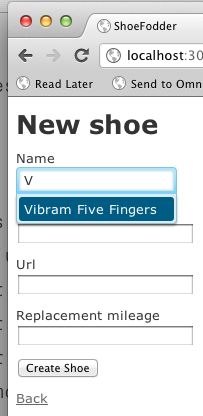

# Using Kendo with Ruby on Rails

**Summary** 

Today, we're announcing the availability of a RubyGem that helps you quickly add Kendo UI to your Rails applications. In this post, I'll share an overview of the Gem, a quick tutorial on how to use it, and even a video of the new Gem in action.

### A RubyGem?

In addition to putting together some killer features for the next release of Kendo UI ([have you seen the latest beta](http://demos.kendoui.com/beta/)? It's awesome!) we also want to give you the best resources for building awesome sites and applications with Kendo UI. Along those lines, we've created a RubyGem for using Kendo in Rails applications that we'd like to share with you today.

The gem, which is designed to get Kendo into your Rails apps with little manual effort on your part, is called '[kendoui-rails](https://rubygems.org/gems/kendoui-rails).' If you want the sources, check it out over at [http://github.com/telerik/kendoui_rails](http://github.com/telerik/kendoui_rails), and feel free to fork it, send us pull-requests, enter issues or offer any other kind of feedback you think we need. 

> this kendo-rails gem provides a GPLv3-licensed version of the latest major release of Kendo UI Web.

### Cool. How do I use it?

Getting started with the Gem is simple, just create a new Rails application (if you already have one, skip this step). Mine is called 'shoe_fodder':

	$ rails new shoe_fodder
 	$ cd shoe_fodder

Then, edit your Gemfile by adding a reference to the gem, just after `gem 'jquery-rails'`:

	gem 'kendoui-rails'

Now, return to your console and run `bundle install.` Check that wall of text that Bundler sends your way to confirm that kendoui-rails (v0.0.5 at the time of this post) has been properly installed.

This step is where many JavaScript-enabling RubyGems would drop you off, leaving you to handle asset configuration on your own. Not our Gem, though! We said 'little manual effort,' and we meant it. The kendoui-rails Gem includes a custom install generator that will make sure you have all the JavaScript and CSS you need to get cracking with Kendo. Just type the following in your console:

	$ rails generate kendoui:install

Now, depending on your Rails version and environment, one of two things will happen here. If you're using Rails 3.1 or later, and have the new asset pipeline features enabled--they are, by default--the Gem will add the appropriate references to your `app/assets/javascripts/application.js` and `app/assets/stylesheets/application.css` files:

	// app/assets/javascripts/application.js
	//= require kendo/kendo.all.min

	/* app/assets/stylesheets/application.css */
	*= require kendo/kendo.common.min
	*= require kendo/kendo.default.min

If, on the other hand, you're using Rails 3.0 or previous, or have the asset pipeline disabled, the Gem will manually copy all the needed assets into your `public/` folder. From there, you can add the proper `<link>` and `

Then, I'll start up my server

	$ rails server

And, open up a browser at localhost:3000/shoes/new. 

 

That's it! I'm rocking and rolling with Rails and Kendo UI from scratch in under three minutes. Or two minutes and twenty-seven seconds, to be exact. To show you just how quick this whole process can be--and prove that I didn't make that 2:2\. figure up--I recorded myself going through the exact same steps as above. Check out the embedded video below, or [watch it over on our YouTube channel](http://www.youtube.com/watch?v=7_KlxiCMQe8\. (Note: be sure to watch in Fullscreen mode to get all of the detail.)

### See the Gem in Action

<iframe width="560" height="315" src="http://www.youtube.com/embed/7_KlxiCMQe8" frameborder="0"></iframe>

### Give us Your Feedback!

So what do you think? Is this Gem useful for your development? Let us know what you think here, and feel free to also suggest improvements, new features or anything here or over at the GitHub Repo.

### Links

[kendoui-rails on GitHub](https://github.com/telerik/kendoui_rails)
[kendoui-rails at RubyGems.org](https://rubygems.org/gems/kendoui-rails) 

[Screencast on YouTube](http://www.youtube.com/watch?v=7_KlxiCMQe8)