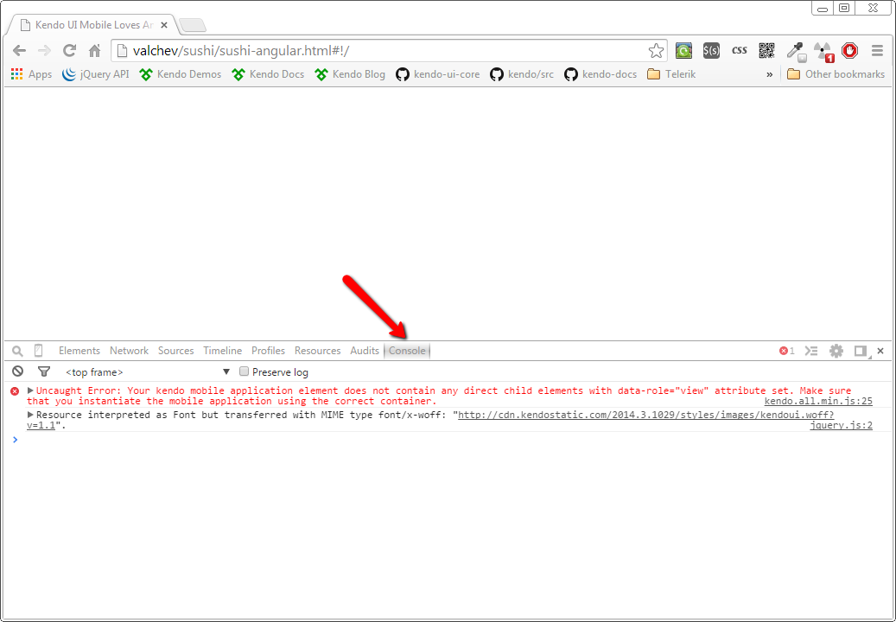
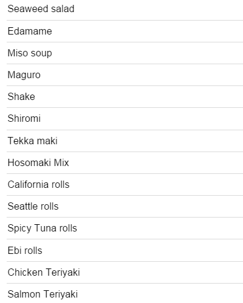
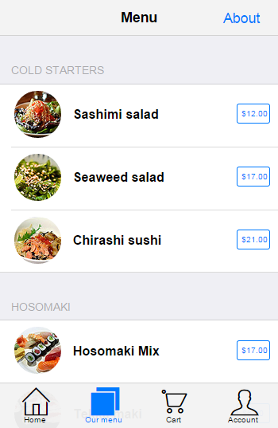
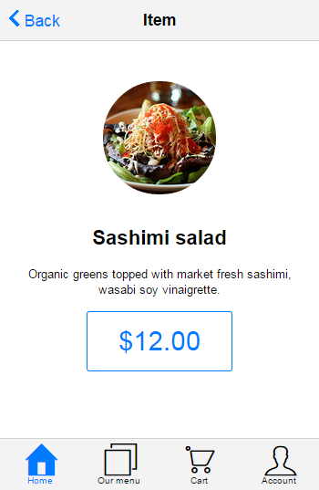
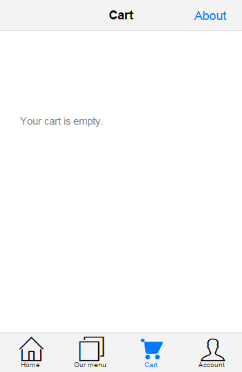

# Tutorial: Building applications with Kendo UI Mobile and AngularJS

Since Q3 2014, Kendo UI includes AngularJS directives for the mobile Application and the mobile View, SplitView, and ModalView components.
In that context, the mobile views support AngularJS controllers, directives and two way data binding expressions.
This tutorial introduces the Kendo UI Mobile AngularJS integration and will walk you through the construction of an AngularJS Kendo UI Mobile web app.

## Application description

//explain what the application does

## 1. Set up

Create a new empty HTML file and include jQuery, AngularJS and Kendo UI. In this tutorial I will [load the prerequisites from CDN](http://docs.telerik.com/kendo-ui/install/cdn).
Alternatively you may [download and host Kendo UI in your project](http://docs.telerik.com/kendo-ui/install/onsite).

    <!DOCTYPE html>
    <html>
    <head>
        <meta charset="utf-8">
        <title>Kendo UI Mobile Loves AngularJS</title>

        <link rel="stylesheet" href="http://cdn.kendostatic.com/2014.3.1029/styles/kendo.mobile.all.min.css">
        <!-- the application CSS file -->
        <link rel="http://demos.telerik.com/kendo-ui/content/mobile/apps/sushi/css/style.css">

        
        
        
    </head>
    <body>

    </body>
    </html>

> Important! In order for the Angular bindings to be activated, you **must load angular.js before Kendo**.

## 2. Bootstrap the mobile application

To initialize the mobile application add a `kendo-mobile-application` attribute to the `body` element together with the `ng-app` attribute.
The `kendo-mobile-application` attribute represents an Angular directive which is used to flag the html element that Kendo UI should consider to be the root element of our mobile application.
This gives developers the freedom to specify if the entire html page or only a portion of it should be treated as Kendo UI Mobile application container.

> In order for the Kendo Angular directives to be evaluated we **must declare dependency on "kendo.directives"** when creating the AngularJS application.

    <!DOCTYPE html>
    <html>
    <head>
        <meta charset="utf-8">
        <title>Kendo UI Mobile Loves AngularJS</title>

        <link rel="stylesheet" href="http://cdn.kendostatic.com/2014.3.1029/styles/kendo.mobile.all.min.css">
        <!-- the application CSS file -->
        <link rel="http://demos.telerik.com/kendo-ui/content/mobile/apps/sushi/css/style.css">

        
        
        
    </head>
    <body kendo-mobile-application ng-app="sushiMobileApp">

        

    </body>
    </html>

If you run the application at this point and open [Chrome Developer tools](https://developer.chrome.com/devtools) you should see a JavaScript error in the console.

This happens because we did not create a mobile View element yet. Let's add one.

## 3. Create "Home" View

The "Home" View will display a list of featured products. It will be also the application initial View.

    <body kendo-mobile-application ng-app="sushiMobileApp">

        <kendo-mobile-view id="index">
            Home View
        </kendo-mobile-view>

        

    </body>

Run the application. Now there should be no errors and the screen should display the index View.

For live preview please click [here](http://dojo.telerik.com/@valchev/exeS)

> To include Kendo UI widgets in the application you may use custom tags or standard tags with custom attributes. Both syntaxes are valid.

For example:

    <!-- custom tag -->
    <kendo-mobile-view id="index">
        Index View
    </kendo-mobile-view>

    <!-- standard tag with custom attribute -->
    

        Index View
    

## 4. Make the application SEO friendly

In order to [create a SEO friendly](http://googlewebmastercentral.blogspot.com/2009/10/proposal-for-making-ajax-crawlable.html) mobile application all you need to do is turning on the [`hashBang`](http://docs.telerik.com/kendo-ui/api/javascript/mobile/application#configuration-hashBang) configuration.
We may [set the configuration option directly in the mark-up](http://docs.telerik.com/kendo-ui/AngularJS/introduction#widget-options-in-html).

    <body kendo-mobile-application k-hash-bang="true" ng-app="sushiMobileApp">

## 5. Display list of data

Now when we have a very basic mobile application running, it is time to add some data.
We are going to create controller for the index View, a [DataSource](http://docs.telerik.com/kendo-ui/framework/datasource/overview) that will be responsible for loading the data and a [mobile ListView](http://docs.telerik.com/kendo-ui/mobile/listview/overview) widget that will be responsible for displaying it.

### 5.1. Add view controller

Create new AngularJS controller and name it "indexController".

    angular.module('sushiMobileApp', [ 'kendo.directives' ])
        .controller('indexController', ['$scope', function($scope) {

        }]);

Use the `ng-controller` directive to associate the "indexController" with the "index" View. The controller definition will be executed each time the view is shown.

    <kendo-mobile-view id="index" ng-controller="indexController">
        Index view
    </kendo-mobile-view>

### 5.2. Add service and application DataSource

In this tutorial we will load the data from an external JSON file called "menu.json".
The data is going to be used in multiple application Views which is why the DataSource instance should be shared across multiple controllers.
To organize the code we will create an [AngularJS service](https://docs.angularjs.org/guide/services) called "sushiCart" that will hold the application DataSource and methods.
The service will be later injected in the mobile View controllers.

    .service('sushiCart', function() {

        this.init = function() {
            //the application DataSource
            this.productsDataSource = new kendo.data.DataSource({
                transport: {
                    read: {
                        url: "content/menu.json",
                        dataType: "json"
                    }
                }
            });
            //observable array that will be used to store products that user has selected
            this.added = new kendo.data.ObservableArray([]);
            //field that will hold reference to the last selected product (used for displaying the details)
            this.currentItem = null;
        };

    })

When the injector is done loading all modules we should run the init method of the "sushiCart" service. At this point the application DataSource and the observable array will be initialized.

    angular.module('sushiMobileApp', [ 'kendo.directives' ])
        .run(['sushiCart', function(sushiCart){
            sushiCart.init();
        }])
        .service('sushiCart', function() {
            /* ... */
        })

Last we need to declare dependency for the "sushiCart" service in the "indexController" and assign "sushiCart" to the scope.

    angular.module('sushiMobileApp', [ 'kendo.directives' ])
        .run(['sushiCart', function(sushiCart){
            sushiCart.init();
        }])
        .service('sushiCart', function() {
            /* ... */
        })
        .controller('indexController', ['$scope', 'sushiCart', function($scope, sushiCart) {
            $scope.sushiCart = sushiCart;
        }])

### 5.3. Create a ListView and bind it to the DataSource

To insert a ListView in the "index" view add a `<kendo-mobile-list-view></kendo-mobile-list-view>` element and bind the "productsDataSource" through `k-data-source` attribute.
It is mandatory to also define a template that determines how the data will be displayed.

        <kendo-mobile-list-view id="featured" class="item-list" k-data-source="sushiCart.productsDataSource">
            
{{dataItem.name}}

        </kendo-mobile-list-view>

At this step we will define a very basic template to verify that the data is loaded and displayed correctly. Later we will enhance the template with image, button and link to details view.
If you run the application now you should see a list of products.

For live preview please click [here](http://dojo.telerik.com/@valchev/exeS/3)

## 6. Add application layout

In this step we will create the application [layout](http://docs.telerik.com/kendo-ui/mobile/layout). To define a Layout add a `<kendo-mobile-layout>` in the page and sets its `id` option.

    <kendo-mobile-layout k-id="'default'">
        <kendo-mobile-header>
            <kendo-mobile-nav-bar>
                <kendo-view-title></kendo-view-title>
                <kendo-mobile-button class="about-button" k-align="'right'" href="content/about-angular.html">About</kendo-mobile-button>
            </kendo-mobile-nav-bar>
        </kendo-mobile-header>

        <kendo-mobile-footer>
            <kendo-mobile-tab-strip>
                <a href="#!/" data-icon="home">Home</a>
                <a href="#!menu" data-icon="organize">Our menu</a>
                <a href="#!cart" data-icon="cart">Cart</a>
                <a href="#!account" data-icon="contacts">Account</a>
            </kendo-mobile-tab-strip>
        </kendo-mobile-footer>
    </kendo-mobile-layout>

The content inside `<kendo-mobile-header>` tag will be used as a header for all View elements that use the "default" layout.
You may include navigation widgets such as Button or TabStrip in the layout header/footer. They will be automatically initialized by the framework after the Layout is created.

To tell the "index" View to use the "default" layout we should set its `layout` configuration option to be equal to the Layout id.

    <kendo-mobile-view id="index" k-title="'Kendo sushi'" k-layout="'default'" ng-controller="indexController">
        <kendo-mobile-list-view id="featured" class="item-list" k-data-source="sushiCart.productsDataSource">
            
{{dataItem.name}}

        </kendo-mobile-list-view>
    </kendo-mobile-view>

> Notice an important detail in the example above: the **string 'default' is quoted inside the attribute value**.
Without the single inside it will be interpreted as variable name and Angular-Kendo will look for $scope.default variable.
Because omitting the quotes is a common error, Angular-Kendo will emit a warning in the JavaScript console when such variables are not found.

Reload the application and observe the new look. Have in mind that at present the "Our menu", "Cart", "Account" and "About" views does not exists yet which is why clicking on any of the links will result in JavaScript error.

For live preview please click [here](http://dojo.telerik.com/@valchev/exeS/4)

## 7. Create "Our Menu" View

The "Our Menu" View will display a list of all products grouped by their first letter in alphabetical order.
Add a new mobile View called "Our Menu", inside it add a new ListView with ID "menuList" and create new controller called "menuController". Bind the ListView to the "productsDataSource".

    <kendo-mobile-view id="menu" k-title="'Menu'" k-layout="'default'" ng-controller="menuController">
        <kendo-mobile-list-view id="menuList" class="item-list" k-data-source="sushiCart.productsDataSource">
            
{{dataItem.name}}

        </kendo-mobile-list-view>
    </kendo-mobile-view>

    .controller('menuController', ['$scope', 'sushiCart', function($scope, sushiCart) {
        $scope.sushiCart = sushiCart;
    }])

## 8. Use event handlers

In this step we will configure the ListView located in "Home" View to display only the featured products and the ListView located in "Our Menu" View to display list of all products grouped by their first letter and ordered alphabetically.
In order to do that we will use the [DataSource API](http://docs.telerik.com/kendo-ui/api/javascript/data/datasource#methods) and the [beforeShow](http://docs.telerik.com/kendo-ui/api/javascript/mobile/ui/view#events-beforeShow) event of the mobile View.

Add `k-on-before-show` attribute to the View elements and specify the event handler name.

    <kendo-mobile-view id="index" k-title="'Kendo sushi'" k-layout="'default'" k-on-before-show="filterFeatured()" ng-controller="indexController">
        <kendo-mobile-list-view id="featured" class="item-list" k-data-source="sushiCart.productsDataSource">
            
{{dataItem.name}}

        </kendo-mobile-list-view>
    </kendo-mobile-view>

    <kendo-mobile-view id="menu" k-title="'Menu'" k-layout="'default'" k-on-before-show="groupByCategory()" ng-controller="menuController">
        <kendo-mobile-list-view id="menuList" class="item-list" k-data-source="sushiCart.productsDataSource">
            
{{dataItem.name}}

        </kendo-mobile-list-view>
    </kendo-mobile-view>

The "filterFeatured" and "groupByCategory" event handlers should be declared in the controllers and assigned to the scope.

    .controller('indexController', ['$scope', 'sushiCart', function($scope, sushiCart) {
        $scope.sushiCart = sushiCart;

        $scope.filterFeatured= function() {
            //remove all groups
            $scope.sushiCart.productsDataSource.group([]);
            //filter only those records that are featured
            $scope.sushiCart.productsDataSource.filter({ field: "featured", operator: "eq", value: true });
        }
    }])
    .controller('menuController', ['$scope', 'sushiCart', function($scope, sushiCart) {
        $scope.sushiCart = sushiCart;

        $scope.groupByCategory = function() {
            //remove all filters
            $scope.sushiCart.productsDataSource.filter([]);
            //group items by category
            $scope.sushiCart.productsDataSource.group({ field: "category" });
        }
    }])

For live preview please click [here](http://dojo.telerik.com/@valchev/exeS/5)

## 9. Customize templates

In this step we will customize the ListView item template - we will add image of the product, information about the price as well as a button that will allow the user to add it to the cart.
Because both of the ListViews share the same template, we will extract it in a separate `

Inside the template we use AngularJS directives inside the template and the double curly brace notation `{{ }}` to bind expressions to elements.

> It is important to note that this is still a Kendo UI Template so you [must escape the `#` symbols](http://docs.telerik.com/kendo-ui/framework/templates/overview#template-syntax).

Before we can pass the template to the widgets we have to assign it to the View controller's scope.
Let's create a service that will hold reference to the template.

    .factory('templates', function() {
        return {
            menuTemplate: $("#menuTemplate").html()
        };
    })

Next we should add dependency for the "templates" service in "indexController" and "menuController".

    .controller('indexController', ['$scope', 'sushiCart', 'templates', function($scope, sushiCart, templates) {
        $scope.sushiCart = sushiCart;
        $scope.templates = templates;

        $scope.filterFeatured= function() {
            $scope.sushiCart.productsDataSource.group([]);
            $scope.sushiCart.productsDataSource.filter({ field: "featured", operator: "eq", value: true });
        }
    }])
    .controller('menuController', ['$scope', 'sushiCart', 'templates', function($scope, sushiCart, templates) {
        $scope.sushiCart = sushiCart;
        $scope.templates = templates;

        $scope.groupByCategory = function() {
            $scope.sushiCart.productsDataSource.filter([]);
            $scope.sushiCart.productsDataSource.group({ field: "category" });
        }
    }])

Last we have to tell the ListViews to use the new template. Add `k-template="sushiCart.menuTemplate"` attribute to the ListView elements.

    <!-- featured list -->
    <kendo-mobile-list-view id="featured" class="item-list" k-template="templates.menuTemplate" k-data-source="sushiCart.productsDataSource">
    </kendo-mobile-list-view>

    <!-- all products list -->
    <kendo-mobile-list-view id="menuList" class="item-list" k-template="templates.menuTemplate" k-data-source="sushiCart.productsDataSource">
    </kendo-mobile-list-view>

For live preview please click [here](http://dojo.telerik.com/@valchev/exeS/6)

## 10. Display details for each record

Note that in the template we added an anchor element that leads to a details View but the link is not functional yet. In this step we will create and bind the details View.
Add new `<kendo-mobile-view>` with ID "details", create a "detailsController" and hook up to the show event of the View.

    <kendo-mobile-view id="details" k-transition="'slide'" k-layout="'default'" ng-controller="detailsController" k-on-show="setCurrentItem(kendoEvent)">
        <kendo-mobile-header>
            <kendo-mobile-nav-bar>
                <kendo-mobile-back-button k-align="'left'">Back</kendo-mobile-back-button>
                <kendo-view-title>Item</kendo-view-title>
            </kendo-mobile-nav-bar>
        </kendo-mobile-header>

        <kendo-mobile-content>
            
            <h2>{{sushiCart.currentItem.name}}</h2>
            
{{sushiCart.currentItem.description}}

            <kendo-mobile-button id="buy-now" k-on-click="sushiCart.addToCart(kendoEvent)">
                {{sushiCart.currentItem.price | currency}}
            </kendo-mobile-button>
            {{sushiCart.currentItem.ordered}}
        </kendo-mobile-content>
    </kendo-mobile-view>

In the show event handler we should set the cart's "currentItem" and the framework will automatically evaluate the template expressions.
We will obtain the item ID thought the query string parameters of the View, then we will use the DataSource [get method](http://docs.kendoui.com/api/framework/datasource#methods-get) to get the dataItem that corresponds to the ID parameter.

    .controller('detailsController', ['$scope', 'sushiCart', function($scope, sushiCart){
        $scope.sushiCart = sushiCart;

        $scope.setCurrentItem = function(kendoEvent) {
            var id = parseInt(kendoEvent.view.params.id);
            sushiCart.setCurrentItem(id);
        }
    }])

> The ID of the last clicked item is passed through the query string parameters of the navigate URL: `href="\#!details?id={{dataItem.id}}"`

Implement the "setCurrentItem" method in the "sushiCart" service.

    .service('sushiCart', function() {

        this.init = function() {
            //the application DataSource
            this.productsDataSource = new kendo.data.DataSource({
                transport: {
                    read: {
                        url: "content/menu.json",
                        dataType: "json"
                    }
                }
            });
            //observable array that will be used to store products that user has selected
            this.added = new kendo.data.ObservableArray([]);
            //field that will hold reference to the last selected product (used for displaying the details)
            this.currentItem = null;
        };

        this.setCurrentItem = function(id) {
            this.currentItem = this.productsDataSource.get(id);
        };
    })

Now if the user clicks on an item the application will navigate to a new View and displaying the product details.

For live preview please click [here](http://dojo.telerik.com/@valchev/exeS/7)

## 11. Create the "Cart" View

The "Cart" View will display a list of products that are already added products, the total price and a "checkout" button.

    <kendo-mobile-view id="cart" k-title="'Cart'" k-layout="'default'" ng-controller="cartController">
        <h2 id="total">{{sushiCart.showTotal()}}</h2>
        
        <kendo-mobile-button id="checkout" class="red-button" href="#!done" k-on-click="sushiCart.checkout()" ng-show="sushiCart.added.length">Checkout</kendo-mobile-button>
        

    </kendo-mobile-view>

In the "cartList" ListView we are going to provide information about how many times the item was added to the cart, the total sum and delete button that allows the user to remove it from the cart.

    

Add a reference for the "cartItemTemplate" in the "templates" service.

    .factory('templates', function() {
        return {
            menuTemplate: $("#menuTemplate").html(),
            cartItemTemplate: $("#cartItemTemplate").html()
        };
    })

Add "cartController" with dependency to the "sushiCart" and "templates" services.

    .controller('cartController', ['$scope', 'sushiCart', 'templates', function($scope, sushiCart, templates){
        $scope.sushiCart = sushiCart;
        $scope.templates = templates;
    }])

For live preview please click [here](http://dojo.telerik.com/@valchev/exeS/8)

## 12. Add some functionality

You probably noticed that we added click event handlers in the template which are not yet implemented. Since those methods are used by different views in our application we will define the event handlers inside the "sushiCart" service.

### 12.1 Add to cart

The "addToCart" method is called when buttons located in "Home" ListView, "Our Menu" ListView and "Details" ListView are clicked.

    //in the "sushiCart" service
    this.addToCart = function(kendoEvent, dataItem) {
        var that = this, item, ordered;

        item = dataItem ? dataItem : this.currentItem;

        //increment the number which indicates how many times the item is ordered
        ordered = item.get("ordered") || 0;
        ordered += 1;

        item.set("ordered", ordered);

        //add the item to the "added" list and show the 'item added to cart xx times' message
        if (ordered === 1) {
            item.set("visibleMessage", true);
            this.added.push(item);
        }

        //prevent the default behaviour of the anchor tag
        kendoEvent.preventDefault();
    };

> Note that in the event handler a reference to the dataItem is passed directly thought the mark-up `k-on-click="sushiCart.addToCart(kendoEvent, dataItem)"`

    <kendo-mobile-button k-on-click="sushiCart.addToCart(kendoEvent, dataItem)" data-item-id="{{dataItem.id}}">
        {{dataItem.price | currency}}
    </kendo-mobile-button>

### 12.2 Remove from cart

The "removeItem" method is called when delete button in the "Cart" ListView is pressed.

    //in the "sushiCart" service
    this.removeItem = function(kendoEvent, dataItem) {
        var item = dataItem,
        index = this.added.indexOf(item),
        currentView = kendo.mobile.application.view();

        item.set("ordered", 0); //reset the ordered number
        item.set("visibleMessage", false); //hide the 'Item added to cart xx times' message
        this.added.splice(index, 1); //remove the item from the 'added' observable array

        //after removing item from the DataSource we should reset the ListView scroller
        currentView.scroller.reset();
        //prevent the default behaviour of the anchor tag
        kendoEvent.preventDefault();
    };

> Note that in the event handler a reference to the dataItem is passed directly thought the mark-up `k-on-click="sushiCart.removeItem(kendoEvent, dataItem)"`

    <kendo-mobile-button class="red-button" k-on-click="sushiCart.removeItem(kendoEvent, dataItem)" data-item-id="{{dataItem.id}}"
        >&nbsp;&\\#x2716;&nbsp;
    </kendo-mobile-button>

### 12.3 Checkout

    //in the "sushiCart" service
    this.checkout = function() {
        var that = this,
        dataSourceData = this.productsDataSource.data(), //get the dataSource data
        length = dataSourceData.length;

        setTimeout(function () { //loop through the data
            for (idx = 0; idx < length; idx++) {
                dataSourceData[idx].set("ordered", 0); //reset the ordered field
            }

            that.added = []; //clear the added array
        }, 400);
    };

The "checkout" method is called when checkout button in the "Cart" ListView is pressed.

    <kendo-mobile-button id="checkout" class="red-button" href="#!done" k-on-click="sushiCart.checkout()" ng-show="sushiCart.added.length">Checkout</kendo-mobile-button>

### 12.4 Calculate the total price

The "showTotal" method is called when the user navigates to the "Cart" View. It calculates and returns the total price of all items added to the cart.

    this.showTotal = function() {
        var cartItems = this.added,
        total = 0;
        for(var idx = 0; idx < cartItems.length; idx++) {
            total += cartItems[idx].ordered * cartItems[idx].price;
        }
        return kendo.toString(total, "c"); //format the number
    };

The total price will be displayed in the "Cart" View.

    <h2 id="total">{{sushiCart.showTotal()}}</h2>

### 12.5 Toggle the visibility of a label

    this.showLabel = function() {
        return this.currentItem && this.currentItem.ordered > 0;
    };

The "showLabel" method is used to determine whether the ordered label should be displayed.

    {{sushiCart.currentItem.ordered}}

For live preview please click [here](http://dojo.telerik.com/@valchev/exeS/9)

## 13. Create "Account" View

The "Account" View will display some basic information for the user such as name, email address and notification preferences.
Add new View with ID "account" and set its title and layout options.
Inside the View create a ListView widget, unlike other ListView widgets in the application this one will not be bound to DataSource. Items are directly set in the HTML.

    <kendo-mobile-view id="account" k-title="'My Account'" k-layout="'default'">
        <kendo-mobile-list-view k-type="'group'">
            <li>
                Account
                <ul>
                    <li>UsernamekendoSushi</li>
                    <li>Emailsushi@kendoui.com</li>
                </ul>
            </li>
            <li>
                Notifications
                <ul>
                    <li>New products<input type="checkbox" kendo-mobile-switch /></li>
                    <li>Exclusive promos<input type="checkbox" k-checked="true" kendo-mobile-switch /></li>
                </ul>
            </li>
        </kendo-mobile-list-view>
    </kendo-mobile-view>

Note that it is possible to include other widgets in the ListView items, the corresponding directives will be automatically executed.
Since this View will not provide any extra functionality it does not need a controller.

For live preview please click [here](http://dojo.telerik.com/@valchev/exeS/10)

## 14. Create "Done" View

The "Done" View will be shown after checkout and will indicate that the operation is successful.

    <kendo-mobile-view id="done">
        <kendo-mobile-header>
            <kendo-mobile-nav-bar>
                <kendo-view-title>Done!</kendo-view-title>
            </kendo-mobile-nav-bar>
        </kendo-mobile-header>

        <kendo-mobile-content class="km-insetcontent">
            
            <h2>Thanks for shopping!</h2>
            <h3>Your sushi is on the way.</h3>
            <kendo-mobile-button id="done-button" href="#!cart">Done</kendo-mobile-button>
        </kendo-mobile-content>
    </kendo-mobile-view>

For live preview please click [here](http://dojo.telerik.com/@valchev/exeS/11)

## 15. Remote Views

The Kendo mobile Application can load Views remotely, using AJAX. If the navigational widget `href` attribute value **does not start** with a hash (#),
the application considers the View to be remote, and issues an AJAX request to the provided URL. For the sake of this example the last View of our application will be a remote one.

Create a folder named "content" and empty html file inside it called "about-angular.html".

In the remote View file we should include only the View's mark-up without any `<html>`, `<head>` or `<body>` tags. Keep in mind that the content of the remote View will be injected in our application via Ajax so there is no need to include any JavaScript dependencies in the file.
You may read more about Kendo UI Mobile remote Views in [this help topic](http://docs.telerik.com/kendo-ui/mobile/application#remote-views).

In the about View we will include header with title and back button and ListView with [external links](http://docs.telerik.com/kendo-ui/mobile/application#linking-to-external-pages).

    <kendo-mobile-view k-transition="'overlay:up'">
        <kendo-mobile-header>
            <kendo-mobile-nav-bar>
                <kendo-mobile-back-button k-align="'left'">Back</kendo-mobile-back-button>
                <kendo-view-title>About</kendo-view-title>
            </kendo-mobile-nav-bar>
        </kendo-mobile-header>

        <kendo-mobile-content>
            <kendo-mobile-list-view k-type="'group'">
                <li>
                    Photo sources
                    <ul>
                        <li><a target="_top" data-rel="external" href="http://www.flickr.com/photos/gpeters/3469819385/">Sashimi salad</a></li>
                        <!-- more items -->
                    </ul>
                </li>
            </ul>
        </kendo-mobile-content>
    </kendo-mobile-view>
