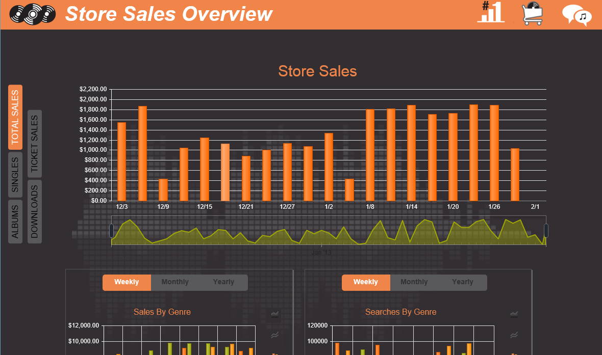
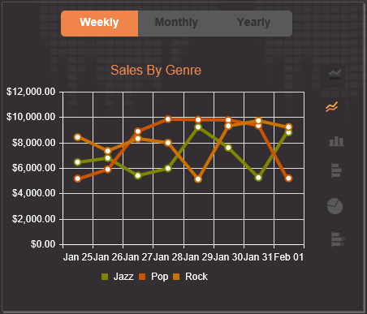
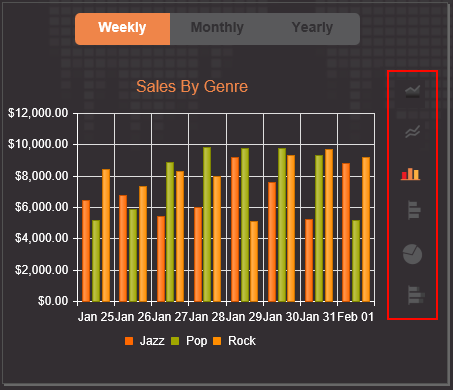
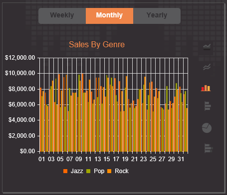

# Building the Store Sales page

This page is constructed to show a collection of DataViz graphs, exposing several different views of store data. The page is domiated by a general sales graph, which can be filtered by five different dimensions, selectable by the buttons to the left of graph.

Two smaller graphs present data grouped by genre: Sales and Searches. These views provide a way to change the type of chart shown, changing the presentation of the data based on user selection of the graph type. The data can also be changed between Weekly, Monthly and Yearly data.

This page is contained in the following files: **app/views/sales.html**, **app/sales-view.js**, and **Content/sales-view.css**.

## Changing Chart Type Dynamically

The **Sales By Genre** chart allows for the chart type to be changed dynamically. The chart can be changed from, for instance, a bar graph

to a line graph

using the buttons down the right side.

The **Sales By Genre** and **Searches By Genre** charts are built similarly, with simple declarative markup and powerful Javascript piping. The chart is contained within it's own **&lt;div&gt;**, with an accompanying **&lt;span&gt;** that contains the buttons for changing the chart type. The Sales By Genre chart is constructed like so:

	

    
       	
        
        
        
        
        
	

Note the **change-genre-sales-chart-type** class on the governing **&lt;span&gt;**, and the **chart-type-item** on the individual **&lt;span&gt;**s; these classes are use to register click events that lead to the chart type changing:

	$(".chart-type-item", ".change-genre-sales-chart-type").click(function (e) {
        e.preventDefault();
        changeChartType.call(this, ".sales-by-genre-chart", ".change-genre-sales-chart-type");
    });

**changeChartType** is a function that performs the chart type change, taking two parameters: the class of the chart to change and the class of the governing **&lt;span&gt;** containing the buttons. The use of the **call()** invocation, along with passing **this** tells the function to perform as a member of the button, rather than globally.

	function changeChartType(chartSelector, parentChartType) {

        removeSelectedGenreSalesType(parentChartType);

        var $this = $(this),
            chartType = $this.data("charttype"),
            chart = $(chartSelector).data("kendoChart"),
            colors = ["#808600", "#cc5300", "#cc7100"],
            i = 0;

        $this.addClass("chart-type-" + chartType + "-selected");

        for (i = 0; i < chart.options.series.length; i++) {

            if (chartType !== "stacked-bar") {
                chart.options.series[i].type = chartType;
                chart.options.series[i].stack = false;
            } else {
                chart.options.series[i].type = "bar";
                chart.options.series[i].stack = true;
            }

            chart.options.series[i].color = colors[i];
            chart.options.series[i].opacity = 1;
            
        }

        chart.redraw();
    }

First, this function clears the buttons' selection state for the chart in question.

The chart is location using jQuery and the first parameter **chartSelector** - this provides access to the chart's options.

The button that was called is marked as selected using the **$this** variable, provided via the **call()** invocation.

The chart's options are then changed to the selected chart type, and the chart is then commanded to redraw, showing the new chart.

## Changing Temporal Data Dynamically

The **Sales By Genre** and **Searches By Genre** charts also provide a method to dynamically change the temporal data in use. For example, using the buttons on top, the **Sales By Genre** chart can be changed from showing Weekly data

to showing Monthly data.

As before, the two charts are constructed similarly, with declarative markup and Javascript. (And jQuery, of course!)

The chart is defined with the buttons in the previous section, and so aren't included here with the declaration of the tabs used as buttons for the temporal data:

    

        Weekly
        Monthly
        Yearly
    

The **genre-sales-tab** class' click event handler is then defined in the Javascript:

    $(".genre-sales-tab").click(function (e) {

        var $this = $(this);

        if ($this.hasClass("time-sales-tab-selected")) {
            return;
        }

        $(".time-sales-tab", "#sales-by-genre").removeClass("time-sales-tab-selected");

        var period = $this.data('period');

        $this.addClass("time-sales-tab-selected");

        salesByGenreChartDataSource
            .options.transport.read.url = "api/salesbygenre/" + period;

        $('.sales-by-genre-chart')
            .data('kendoChart')
            .options.categoryAxis.labels = getLabelOptions(period);

        salesByGenreChartDataSource.read();
    });

This function is set to only update the data if a different set of data has been selected, then updates the selection in the UI.

It retrieves the desired time period from the **data-period** attribute, then adjusts the data source that provides the chart its data. This results in a different API call, and therefore new data. The data source's **read()** function is then called to update the data in the chart, which makes the chart redraw, presenting the new data to the user.